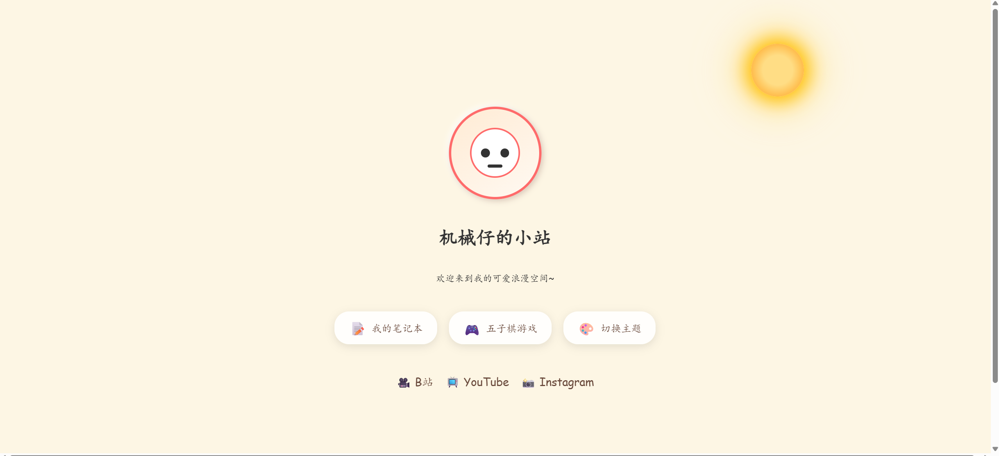
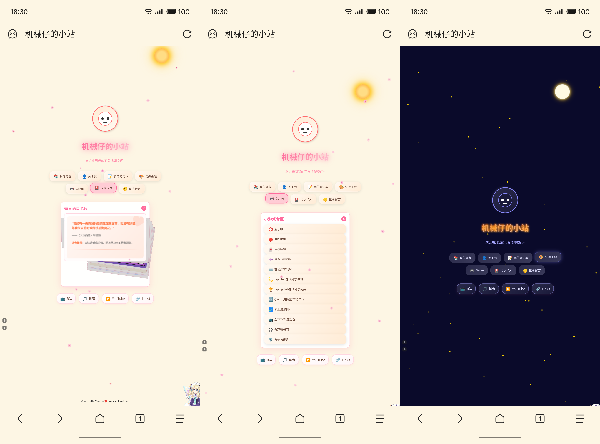
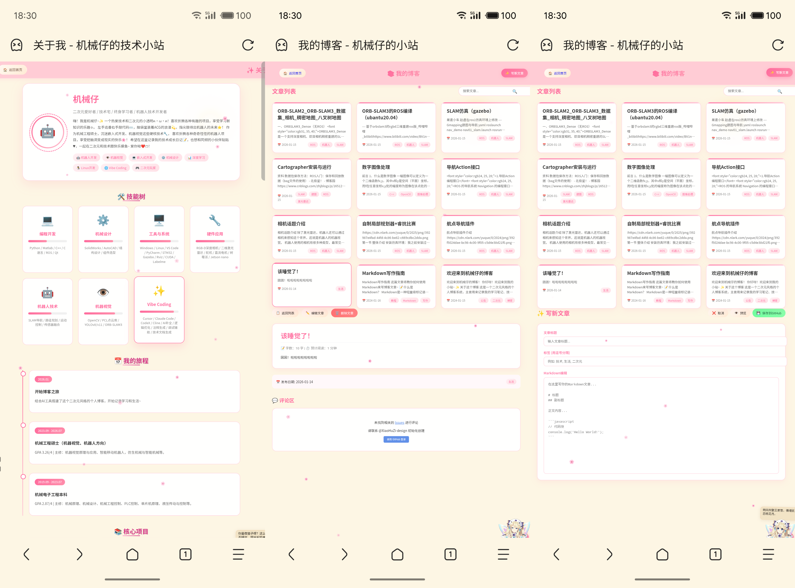
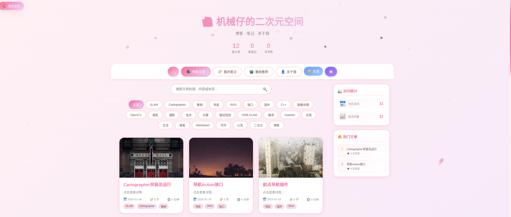
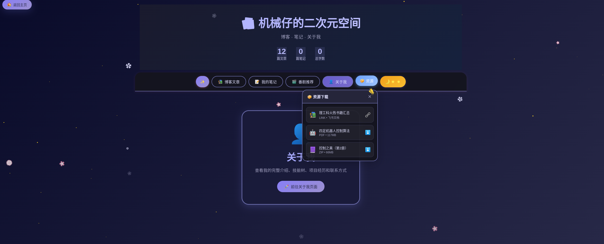

# 🌸 机械仔的小站

<div align="center">


一个二次元风格的个人博客系统，支持 Markdown 文章、GitHub 存储、Gitalk 评论等功能。

[在线预览](https://ht-libra.top) | [快速开始](#-快速开始) | [功能特性](#-特性)

</div>

---

## 📸 预览







---

## ✨ 特性

### 🏠 首页 (`index.html`)
- 🌸 **樱花飘落动画** - 浪漫的动态樱花背景
- 🌙 **日夜主题切换** - 太阳/月亮 + 星空双主题
- 🤖 **机器人吉祥物** - 可爱的互动吉祥物
- 🎴 **语录卡片展示** - Swiper 翻牌效果
- 👧 **Live2D 看板娘** - 萌萌的二次元看板娘
- 📊 **实时数据统计** - 文章数量、标签统计
- 📰 **最新文章展示** - 首页展示最新 3 篇文章

### 📚 博客系统
#### 主页面 (`anime-blog.html`)
- 📝 **Markdown 文章支持** - 完整的 Front Matter 元数据解析
- 🔍 **文章搜索功能** - 支持标题、内容、标签搜索
- 🏷️ **标签分类** - 按标签筛选文章
- 📄 **分页显示** - 每页 9 篇文章，支持分页导航
- 🎨 **代码语法高亮** - 基于 highlight.js
- 💬 **Gitalk 评论系统** - GitHub 登录评论
- 📱 **响应式设计** - 适配各种设备
- 🌓 **暗黑模式** - 护眼的夜间阅读体验
- 🔄 **GitHub API 自动重试** - 网络问题自动重试机制
- 🎬 **番剧推荐** - 可跳转链接的番剧卡片展示

#### 管理页面 (`blogs/blog.html`)
- ✏️ **在线写文章** - 直接在浏览器中写文章
- 📤 **一键发布** - 保存到 GitHub 仓库
- ✏️ **编辑文章** - 修改已发布的文章
- 🗑️ **删除文章** - 删除不需要的文章
- 🔐 **Token 管理** - 安全的本地存储

#### 资源下载
- 📦 **资源管理** - PDF、ZIP 等文件下载
- 🔗 **外部链接** - 支持飞书文档等外部资源
- 📊 **动态加载** - 配置化管理资源列表

#### 笔记功能 (`notes/`)
- 📝 **本地笔记管理** - 支持添加、编辑、删除笔记
- 💾 **本地存储** - 使用 localStorage 保存
- 🎨 **卡片式展示** - 美观的笔记卡片布局

### 👤 个人简历 (`abouts/`)
- 🎯 **技能树可视化** - 展示专业技能
- 📅 **个人经历时间线** - 清晰的成长轨迹
- 💖 **兴趣爱好展示** - 个性化介绍
- 📮 **联系方式卡片** - 多渠道联系

### 🎮 其他功能
- ♟️ **五子棋小游戏** (`game.html`) - 人机对战
- 🔐 **登录系统** (`login.html`) - 简单的身份验证
- 🎴 **语录卡片** (`card/`) - 精美的卡片展示

---

## 📁 项目结构

```
机械仔的小站/
│
├── 📄 页面文件
│   ├── index.html              # 首页
│   ├── anime-blog.html         # 主博客页面（推荐）
│   ├── blog.html               # 旧版博客页面
│   ├── login.html              # 登录页面
│   └── game.html               # 五子棋游戏
│
├── 📂 功能模块
│   ├── blogs/                  # 博客管理模块
│   │   ├── blog.html           # 博客管理页面
│   │   ├── blog.js             # 博客逻辑
│   │   └── blog.css            # 博客样式
│   │
│   ├── abouts/                 # 个人简历模块
│   │   ├── about.html
│   │   ├── about.css
│   │   └── about.js
│   │
│   ├── notes/                  # 笔记模块
│   │   ├── notes.html
│   │   ├── notes.css
│   │   └── notes.js
│   │
│   ├── card/                   # 语录卡片模块
│   │   ├── index.html
│   │   ├── style.css
│   │   └── script.js
│   │
│   └── posts/                  # Markdown 文章目录
│       ├── welcome-to-my-blog.md
│       ├── markdown-guide.md
│       ├── cartographer安装及运行.md
│       ├── 航点导航插件.md
│       ├── 图像处理（C++）.md
│       └── ...（更多文章）
│
├── 🎨 样式文件
│   ├── css/
│   │   ├── main.css            # 主样式（樱花/星空主题）
│   │   ├── blog.css            # 博客样式
│   │   └── about.css           # 简历样式
│   │
│   ├── anime-blog.css          # 主博客样式（单文件）
│   ├── game.css                # 游戏样式
│   └── style.css               # 通用样式
│
├── 📜 脚本文件
│   ├── js/
│   │   ├── main.js             # 主脚本（主题、樱花、GitHub API）
│   │   ├── blog.js             # 博客核心逻辑
│   │   ├── auth-guard.js       # 认证守卫
│   │   └── login.js            # 登录逻辑
│   │
│   ├── posts-index.js          # 文章索引配置（已废弃，改用 GitHub API）
│   ├── welcome.js              # 首页交互
│   ├── kbn.js                  # 看板娘脚本
│   └── script.js               # 通用脚本
│
├── 📦 资源文件
│   ├── resources/              # 下载资源
│   │   ├── 控制之美-2册.zip
│   │   └── ...
│   │
│   ├── assets/                 # 静态资源
│   └── posts/assets/           # 文章图片资源
│
├── 🔧 配置文件
│   ├── package.json            # NPM 配置
│   ├── webpack.config.js       # Webpack 配置
│   └── CNAME                   # 自定义域名配置
│
└── 📄 文档
    └── README.md               # 项目说明文档
```

---

## 🚀 快速开始

### 1. 克隆项目

```bash
git clone https://github.com/XiaoHuZi-design/HTBLOG.git
cd HTBLOG
```

### 2. 安装依赖（可选）

如果需要使用 Webpack 构建：

```bash
npm install
```

### 3. 本地预览

使用任意本地服务器运行项目：

```bash
# 方式1：使用 Python
python -m http.server 8080

# 方式2：使用 Node.js
npx serve .

# 方式3：使用 VS Code Live Server 插件
# 右键 index.html -> Open with Live Server
```

然后访问 `http://localhost:8080`

### 4. 构建生产版本（可选）

```bash
npm run build
```

---

## ⚙️ 配置

### GitHub API 配置

编辑 `js/main.js` 中的 `CONFIG`：

```javascript
const CONFIG = {
    GITHUB: {
        owner: '你的GitHub用户名',      // 例如: 'XiaoHuZi-design'
        repo: '你的仓库名',             // 例如: 'HTBLOG'
        branch: '分支名',               // 默认: 'main'
        path: '文章目录'                // 默认: 'posts'
    },
    GITALK: {
        clientID: 'OAuth App Client ID',
        clientSecret: 'OAuth App Client Secret',
        repo: '评论存储仓库',
        owner: '你的GitHub用户名',
        admin: ['你的GitHub用户名']
    }
};
```

### 资源下载配置

编辑 `anime-blog.html` 中的 `RESOURCES` 数组：

```javascript
const RESOURCES = [
    {
        name: '资源名称',
        url: '资源URL或本地路径',
        type: 'pdf|zip|link',  // 类型
        size: '文件大小',
        icon: '📚'             // Emoji 图标
    },
    // 添加更多资源...
];
```

### 番剧推荐配置

编辑 `anime-blog.html` 中的 `ANIME_LIST` 数组：

```javascript
const ANIME_LIST = [
    {
        title: '番剧名称',
        cover: '封面图片URL',
        rating: '评分',
        tags: ['标签1', '标签2'],
        description: '简介描述',
        link: 'https://bgm.tv/subject/xxx'  // 可选：番剧链接
    },
    // 添加更多番剧...
];
```

---

## 📝 写文章

### 方式一：直接在 GitHub 上写

1. 在 `posts/` 目录创建 `.md` 文件
2. 推送到 GitHub 仓库
3. 刷新博客页面即可看到

### 方式二：使用管理页面写文章

1. 访问 `blogs/blog.html`
2. 点击 **⚙️ 设置** 按钮
3. 填写 GitHub Token（需要有仓库写入权限）
4. 点击 **✨ 写新文章** 即可在线编写

### 文章格式

```markdown
---
title: "文章标题"
date: 2024-01-15
tags: ["标签1", "标签2", "标签3"]
---

# 正文内容

这里是 Markdown 正文...
```

### 支持的 Markdown 语法

- 标题（H1-H6）
- 粗体、斜体
- 列表（有序、无序）
- 代码块（带语法高亮）
- 链接、图片
- 表格
- 引用
- 分隔线

---

## 🎨 自定义

### 修改主题颜色

编辑 `css/main.css` 中的 CSS 变量：

```css
:root {
    /* 樱花主题 */
    --primary-pink: #ff6b9d;
    --light-pink: #ff8fab;
    --pale-pink: #ffc3d4;
    --border-pink: #ffd6e0;

    /* 星空主题 */
    --primary-purple: #8a8aff;
    --light-purple: #a8a8ff;
    --lavender: #c4c4ff;
}
```

### 修改个人信息

编辑 `abouts/about.html` 中的内容：

- 头像和昵称
- 个人简介
- 技能树
- 时间线
- 联系方式

### 修改语录卡片

将图片放入 `card/images/` 目录，然后编辑 `card/index.html`。

---

## 🌐 部署到 GitHub Pages

### 方式1：使用 GitHub Pages UI

1. 将代码推送到 GitHub 仓库
2. 进入仓库 **Settings** -> **Pages**
3. **Source** 选择 "Deploy from a branch"
4. **Branch** 选择 "main"，目录选择 "/ (root)"
5. 保存后等待部署完成

### 方式2：使用自定义域名

1. 在仓库根目录创建 `CNAME` 文件
2. 填写你的域名（如 `www.example.com`）
3. 在域名 DNS 设置中添加 CNAME 记录指向 `你的用户名.github.io`

---

## 📋 技术栈

| 技术 | 用途 | 版本 |
|------|------|------|
| HTML5 | 页面结构 | - |
| CSS3 | 样式设计 | - |
| JavaScript (ES6+) | 交互逻辑 | - |
| [marked.js](https://marked.js.org/) | Markdown 解析 | ^4.0.0 |
| [highlight.js](https://highlightjs.org/) | 代码高亮 | ^11.7.0 |
| [Gitalk](https://gitalk.github.io/) | 评论系统 | ^1.7.2 |
| [Swiper](https://swiperjs.com/) | 轮播组件 | - |
| [Live2D](https://github.com/IlysvlVEizbr/Live2D) | 看板娘 | - |
| Webpack 5 | 构建工具 | ^5.65.0 |

---

## 🔄 更新日志

### v2.0 (2025-01)
- ✨ 新增 `anime-blog.html` 主博客页面
- 🎨 全新二次元风格设计
- 📦 新增资源下载功能
- 🔧 优化文章加载机制（直接使用 GitHub API）
- 🌙 新增暗黑模式
- 📱 优化响应式布局
- 🎬 新增番剧推荐卡片（支持链接跳转）
- 🔄 添加 GitHub API 自动重试机制
- 🏷️ 修复标签解析问题（支持多种格式）
- ✏️ 新增博客管理页面（在线写文章）

### v1.0
- 🎉 初始版本发布
- 📝 基础博客功能
- 🌸 樱花主题
- 💬 Gitalk 评论

---

## 🔒 安全说明

### GitHub Token 使用

本项目的博客管理功能使用 GitHub Token 进行文章管理：

- Token 仅保存在用户浏览器的 **localStorage** 中
- 不会上传到服务器或暴露在代码中
- 请勿分享你的 Token 给他人
- 建议使用最小权限的 Token（只需 repo 权限）

### Gitalk 配置

Gitalk 使用 GitHub OAuth App 进行评论：

- Client ID 可以公开
- Client Secret 建议通过后端代理（本项目中为演示直接使用）

---

## 🤝 贡献

欢迎提交 Issue 和 Pull Request！

1. Fork 本仓库
2. 创建特性分支 (`git checkout -b feature/AmazingFeature`)
3. 提交更改 (`git commit -m 'Add some AmazingFeature'`)
4. 推送到分支 (`git push origin feature/AmazingFeature`)
5. 提交 Pull Request

---

## 📄 许可证

本项目采用 MIT 许可证 - 详见 [LICENSE](LICENSE) 文件

---

## 📮 联系方式

- GitHub: [@XiaoHuZi-design](https://github.com/XiaoHuZi-design)
- 博客: [机械仔的小站](https://ht-libra.top)

---

<div align="center">

**如果这个项目对你有帮助，请给一个 ⭐️ Star ~**

Made with ❤️ and 🌸 by 机械仔

</div>
